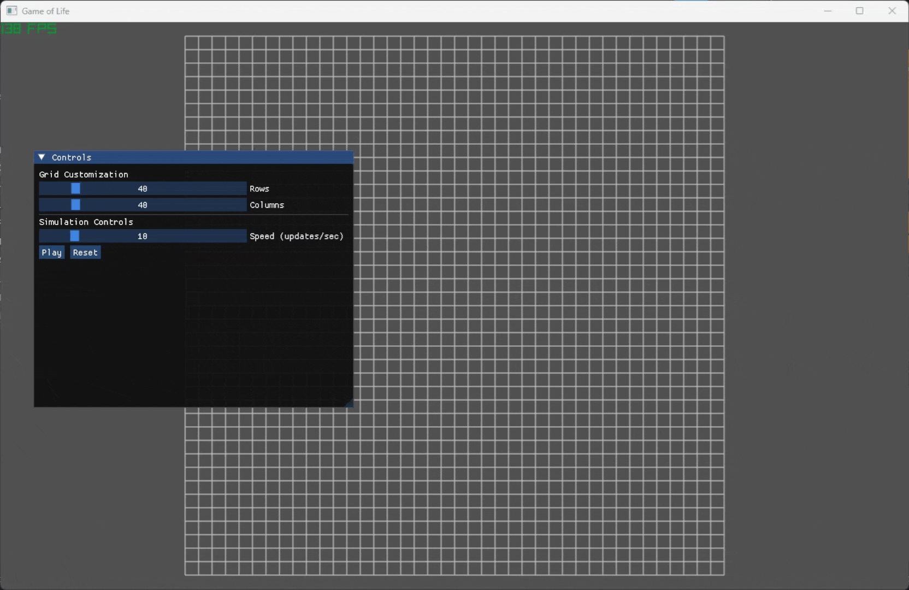

# Conway's Game of Life using Raylib and ImGui

## Showcase



## Setup and compilation

> [!NOTE]  
> This project only supports Windows and the GNU C++ compiler as that is my current setup, other configurations may work but are not guaranteed

1. Clone the repository

```bash
git clone https://github.com/mdpham412/game-of-life.git
```

2. Generate build files

   - With the debug console window:

   ```bash
   cmake -B build -G Ninja -D CMAKE_C_COMPILER=gcc -D CMAKE_CXX_COMPILER=g++
   ```

   - Without the debug console window:

   ```bash
   cmake -B build -G Ninja -D CMAKE_C_COMPILER=gcc -D CMAKE_CXX_COMPILER=g++ -D HIDE_CONSOLE=ON
   ```

3. Compile

```bash
cmake --build build
```
